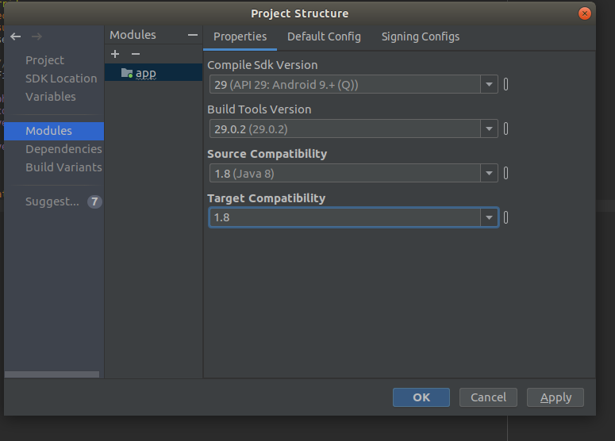

* View'da constrainedLayout ile LinearLayout arasindaki fark, ConstrainedLayout RelativeLayout un gelismis bir versiyonu, bunda child'in parent'a gore veya diger childlara gore align yapabiliyorsun, but in LinearLayout you chose aligment horizontal or vertical and all childs inside the layout have the same aligment.

* if android studio gives error that lambda is not supported than you need to change modeule's target and source java versions from app properties  

* 