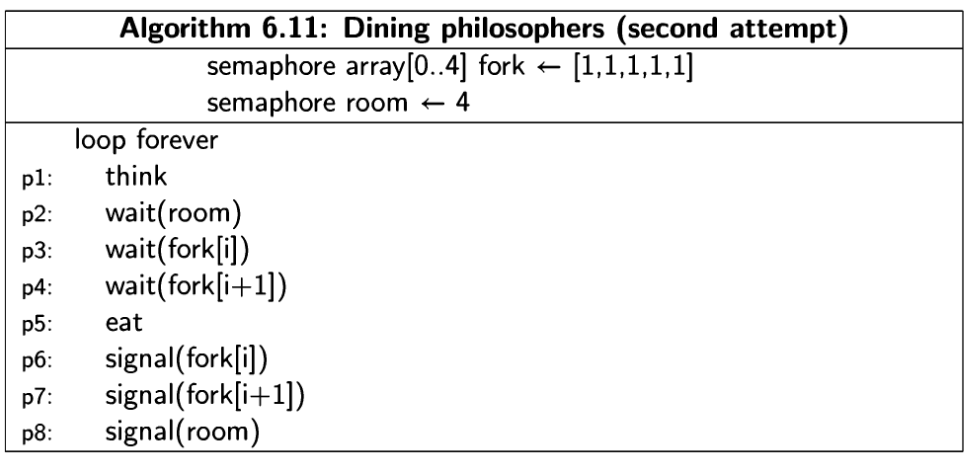
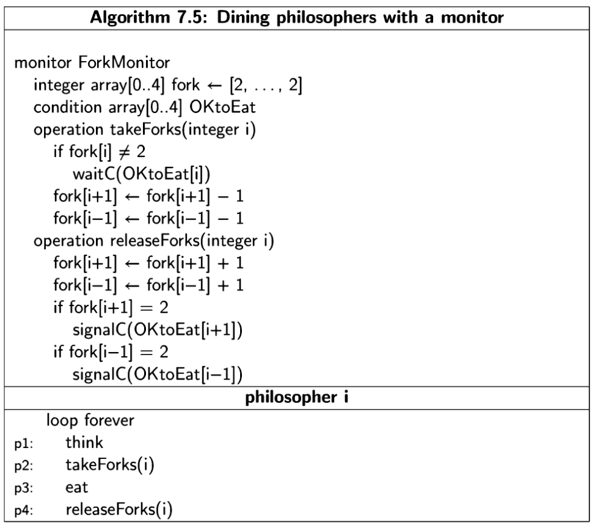

# Cou 1 Characterizaion of Distributed Systems

* what is distributed system?  
Distributed system is, hardware or software components in a networked computer and commununicating and coordinating their actions only with message passing.

* consequences of distributed systems?  
    * concurrency -> parallel sekilde islem yapabilmek
    * no global clock -> clocks are different for each individual system in distributed environment, they can be synced and asynced, but can't share same or global clock value.  
    * Independent failures -> each part of distributed system can fail individually, and other systems can't know if that system really failed, or network is slow. Also when part of a system failed other systems can't know at same moment.

* Challanges of distributed systems
    * heterogeneity -> birden cok cihaz, os, protokol implementasyonu var. Mesela bir sistemin x86 kullanirken digerinin RISC-V kullanmasi, biri IoT cihazken digerinin pc olmasi, biri litte endian iken digerinin big endian olmasi vs
    * openness -> Spesificationlarda veya implementasyonda eksik olursa bunlar sikinti olur. Spesifikasyonlarda her adimin nasil yapilcagi anlatilmaz, bazi yerlere implemente eden kendi handle eder, mesela TCP de gelen paketlerin nasil bufferlanacagi gibi.
    * security -> data ve source'larda bu 3 bilesenin korunmasi lazim, integrity, confidentiality, availability
    * scalability -> resource sayisi arttikca sistemin kaldirabilecegi yukun de o oranda artmasi lazim, 1 server ile 100 kisiye hizmet veriyorsa, 2 server ile 200 olmasi lazim, ama bu pratikte yakalanan birsey degil.
    * failure handling -> failure handling icin cesitli yontemler var.
        1. Detecting faults = checksum gibi yontemlerde datanin hatali oldugunu bulma, yapilabiliyorsa duzeltme.
        2. masking failures = mesela msj gitmediginde yeniden gondermek, veya data tutarken kopyasini da tutup aslina bisi oldugunda kopyasini kullanmak
        3. tolerating faults = web servis cevap vermediginde sonsuza kadar beklemek yerine, kullanicaya bu web servis cevap vermiyor diye donmek
        4. redundancy = ayni processten birden cok olmasi, birinin fail ettiginde digerinin calismasi, HA (High Avability) sistemler.
    * concurrency -> objectlerin, variable'larin concurrent calisirken safe olmalari lazim. Concurrent ortamda bir liste ekleme cikarma yapiliyorsa bu list e o anda sadece bir object'in yazabilmesi lazim. Mutual exclusion
    * transparency -> sistemin collections of independent modules yerine, kullaniciya whole olarak gozukmesi. Mesela spark bir tek user interface sunuyor ve arkadaki clusterda calisan distributed system'i sakliyor.
    * quality of service -> 

    Types of Distributed Systems = Web Pages, MMOGs, Financial Trading, 
    
# Cou 2 System Models
Hardware Model -> Most explicit (acik, belirgin) olan model. Direk Hardware e odaklaip, sistem modelini hardware uzerinden tanimliyor.  
Architecutre Model -> computational ve communicational task'lar ustunden tanimliyor.  
Fundemental Model -> Daha abstract sekilde tanimliyor, 3 tipi var, interaction model elementlar arasindaki iliskileri inceliyor, failure model, sistem ne sekillerde fail edebilir ve ne sekillerde failt ederse calismaya devam etmelidir i inceliyor. Security Model ise datanin calinmasini disardan gelen ataklarin engellenmesini modelliyor.

Distributed system tasarlarken belli zorluklar ve threadler var bunlar
* Distributed system'i olusturan modullerin, birden fazla kullanim alani olabiliyor, mesela web page yapinca bazisi az hit aliyor bazisi cok fazla hit aliyor, veya isin icine mobil cihazlar girdi mi bunlarin her an kopabilecekmis sekilde degerlendirilip sistemin oyle tasarlanmasi gerekiyor.
* Cok fazla degisik environment var, bazi durumlarda sistemin parcalari fark OS farkli hardware'e sahip olabilir. Bagli olduklari network degisebilir, bazen wireless bazen optik olabilir
* Internal problems : Non-sync clocklar, data update ederken cakisma olmasi, cok cesitli hardware ve software failure'lari olabilir.
* External threads : mevcut sisteme attack yapmak isteyenler

## 2.2 Physical Model
Hardware elementlerinin representationi.

## 2.3 Architectural Models
Distributed systemin komponentlerini ve bu komponentler arasindaki communicationi inceliyor. Bu modelin amaci sistemin simdiki ve gelecekti istekleri yerine getirebilecek sekilde yapilandirmak ve sistemi reliable, cost effective ve managable sekilde kurmak.

## 2.4 Fundemental Model
Fundemental modelin 2 maaci, ilki tum yaptigimiz assumptionlari acik ve belirgin yapmak, digeri de generalization ile bu assumptionlari kullanarak neyin possible neyin impoissble oldugunu bulmak.  
Fundemental model sadee essential ingredientleri bulundurmali icinde. Fundemental model 3 farkli model altinda incelenir, bunlar interaction model, failure model ve security model.
ceky
* Interaction Model : Processlerin veya objectlerin birbiri arasinda mesaj ile iletisim kurmasini inceler. 2 onemli faktor Interaction model'i etkiler bunlardan ilki communication channellar her zaman reliable degildir, reliable oldugunda bile jitter delay olur. Ikincisi ise hicbir zaman tam olarak bir global clock yakalanamaz. Bunlara dayanarak sync ve async modeller cikmistir. Sync modelde, process suresi, mesaj gitme suresi ve clock drift suresi belli min max degerleri vardir, async de ise hicbir kisitlama yoktur.

* Failure Model : distributed systemlerde hem process hem de communication channel fail edebilir. Omission failure'lar communication channel in veya process in fail ederek durdugu senaryolar. Arbitrary failure'lar ise fail edip yasamaya devam ettigi senaryolar.

* Security Model : 

# Ari 1 - What is Concurent Programming

A concurrent program is set of sequential instructions that can run in parallel. Fakat terim olarak parallel ve concurrent arasinda bir fark var, Parallel daha cok, ayni anda yani overlap edebilen programlar kodlari icin kullanilirken, concurrency icin potential parallelism diyebiliriz. Yani gunumuzde tek cpu da multitasking olmasi aslinda concurrency iken, birden cok cpu da parallel sekilde bir matrix hesaplanmasi daha cok parallel programming e giriyor. 

Concurrency iyi bir abstraction, cunku aslinda t aninda tek bir programin kodlari calismasina ragmen, bizim birden cok kodun paralel olarka calisiyor olarka dusunmemiz islerimizi kolaylastiriyor. 

Diger taraftan eger bir computerda, birden cok cpu varsa ve isler gercekten parallel sekilde yuruyorsa bile bunlari tek cpu da concurrent sekilde calisiyor olarak dusunmemis yine isleri kolaylastirir.

Bu abstratctionlari yapmamiizin nedeni ise, bizi alt katmanlardaki detaylardan kurtarmasi. Program parallelism i veya concurrency'i dusunurken gidip hardware veya cpu level isleri dusunmemize gerek yok.

## 1.2 Concurrency as abstract parallelism
Multitaskingten bahsediceksin burda, cpu da context switching yapilarak parallelism algisi yaratabilabiliyor insan uzerinde, cunku o kadar hizli degisimleri algilayamiyoruz.

## 1.3 Multitasking
Yukardaki ile ayni

## 1.4 The terminology of concurrency
Process i concurrency teorisinde bir terim olarak aliyoruz.  
Thread i ise daha cok programming language'lerde kullaniyoruz.  
Ikisi arasindaki fark, process kendi adress space'inde yasarken, threadler ayni adress space'ini paylasir, process'in context switch yapmak daha masrafli iken threadlerin daha kolaydir. Ayni zamanda threadlerin kendi icinde haberlesmesi daha kolaydir. 

## 1.6 The Challange of concurrent programming
Iki temel challange var bunlar sync ve communicate. 

# Ari 2 - The Concurrent Programming Abstraction
## 2.1 The role of abstcation
Yazilim muhendisleri genelde 3 kategori de abstraction yapiyor
* Systems and libraries
* Programming languages
* Insrtuction sets

Software engineeringte en onemli abstraction toollari, encapsulation ve concurreny idir.

## 2.2 Concurrenct execution as interleaving of atomic statements
Concurrent program : finite set of sequentual process and these process are written using finite set of atomic statements. Bu atomic statement'leri arbitrarily interleaving seklinde execute edince concurrent program elde ediyoruz. 

Concurrent program state ve state'ler arasindaki transitionlar ile belirtilir. Control pointer'da o process'in hangi state'te oldugunu gosterir. Concurrent programda birden cok process vardir, ve her process'in de kendi control pointer'i vardir. 

State'leri tuple'lar olarka gosteriyoruz ve control pointer'in gosteridigi line ile birlikte, process ile ilgili ve global degiskenleri giriyoruz o tuple'a. 

Transition ise, eger S1 state execute edilgiginde bu S2'yi degistiriyorsa, S1 ile S2 arasinda transition vardir diyebiliriz. 

Scenario ise state'lerin olusturdugu directed graph'lardir. Burda cycle olursa infinite computation da olabilir tabii ki. 

## 2.3 Justification of the abstraction

Pratikte bir global state'den bahsedemiyoruz, cunku en basidinden, bilgisayarlarin speed of light'ta islem yaptigini varsayarsak, 1 Ghz lik makinede 1 clock cycle da en fazla 20cm ilerleyebiliyor isik, bu da global coordination icin yeterli degil. Fakat bir bird's eye view alip, t zamaninda bir kesit alip o anin global state'ini aliyormusuz gibi dusunebiliriz. Bunu yaparken de bir process'in bittigi ve digerinin baslamadan onceki zamani alip yapabiliriz. 

Multitasking sistemler genelde tek cpu'dan olusuyor ve interlaving yapiyorlar ve normalde bir interrupt gelmedigi surece ayni process'in statement'lari ard arda execute edilir, ne zaman interrupt gelirse interrupt handler ile o zaman context switching yapilir. Fakat biz Ortamda 3 process varsa her executionda bu 3 processten birinin statementlarindan biri execute edilebilirmis gibi dunusunucez. Abstractionimiz bu olucak.

Multiprocessoer sistemlerde, Normalde her process kendi cpu'sunda calisir, fakat shared resource erismek istediklerinde yine biz burda bir arbitrary interleaving varmis gibi dusunecegiz. Aslinda hardware yani ram hicbir zaman 2 process'in ayni anda write islemi yapmasina izin vermez, bu atomicty'i kendi saglar. 

Distributed systemlerde ise, bir interleavingten bahsedemesekte, distributed systemlerin 2 durumu oldugunu dusunebiliriz, ya kendi islerini yapiyorlardir ya da mesaj bekliyor veya mesaj gonderiyorlardir, iste bu mesaj alma ve gonderme islemlerinde yine arbitrary interlaving varmis gibi dusunebiliriz.

## 2.4 Arbitrary Interleaving
Burdaki abstactionimiz, normalde cpu'larda bir interrupt gelene kadar ayni process in code'u execute edilir, fakat biz bir code execute edildikten sonra baska bir processten de bir sey execute edilebilir yani durum tamamen arbitrary olarka dusunecegiz.
Peki neden boyle yapiyoruz : cunku bu abstraction formal analizi kolaylastiriyor. Diger bir guzelligi de time intervalllari dusunmek zorunda kalmyioruz, sadece sequence of statementlari incelememiz yetiyor. cunku time interval her cpu da degisir ve bunu hesaba katsaydik her cpu modeli icin ayri bir formal analiz methodu gelistirmemiz gerekicekti. 

Burda onemli bir nokta da neyin atomic statement oldugunu biz beliriyoruz, bunlar secimimize gore coarse-grained veya fine-grained olabilir. 

Arbitrary interleaving abstraction yapmamizin bir baska nedeni de, concurrent programlari bire bir repeat edebilmek cok zor, ve eger bir program tum interleavingler icin correctness ilkesini gosteriyorsa o zaman bu program her kosulde calisiyor diyebiliriz.

## 2.5 Atomic statements
Atomic statement'ta olay eger iki islem simultaneously calisip verdigi sonuclar ile, tek tek calisitrip verdigi sonuclar ayni ise bu iki isleme atomic diyebiliriz. Atomic statement'lari dogru belirlemek onemli, cunku correctness bu atomic statementllari kullanacak.

## 2.6 Correctness
Correctness property'si 2 farkli property'den olusur bunlar safety (the property must always be true) ve Liveness (The property must eventually become true)

Ornek olarak mouse imlecini verebiliriz, mouse imlecinin her zaman ekranda gozukmesi gerekir ve bu safety'dir, (Mouse should always shown on screen) digeri ise mesela mouse u bir bolgeye veya bir dosyaya getirdigimizde orda seklinin degismesi, bu da eventually true olmasi lazim. Veya mousa'la bir yere tiklandiginda sekil degistirmesi, mouse a tikladiktan sonra belki biraz bekleyebliriz ama eventually true olmasi gerekiyor. 

Safety ile liveness birbirinin dual'idir yani negation of safetly is a liveness. Always, a mouse cursor is displayed bir safetely. Bunun negatifi ise Eventually no mouse cursor will be displayed olcak. bu da liveness. Safety'nin true olmasi icin if and only if liveness false olmali.

Concurrent programlarda tum senaryolari test edemeyecegimiz icin formal methodlar ile correnctness'ina bakiyoruz.

## 2.7 Fairness
A  scenario  is  (weakly)  fair  if  at  any  state  in  the  scenario,  a  statement 
that  is  continually  enabled  eventually  appears  in  the  scenario.	

# Ari - 4 Verification of Concurrent Programs
Formal verification yapmak icin model checker tool'lari kullaniyoruz. Bunlarin bir ornegi spin isimli tool. Temporal logic, formal verification yapabilmek icin en efektif yontem. 

## 4.3 Basic concepts of temporal logic
Normal logicte veya matematiksel ifadelerde, bir degiskene sayi atatigimizda o durur, fakat bir computer programi calisirken turn = 1 dogru iken daha sonra turn e 2 degeri atanabilir ve bu sefer de bu false olabilir. Yani turn = 1 bazen true bazen de false olur. Bu durumlari cover edebilmek icin temporal logic ve temporal operatorleri kullaniyoruz. Bunun bir varyasyonu LTL yani linear temporal logic

LTL in bazi elemenlari, always, eventually, duality. 

## 4.6 Model Checking
Eger bir distributed programin reachable state'leri cok fazla degilse, bunun diagrami bir tool a cikarttirip correctness propertylerine bakabiliriz. Mesela bir communication protocol'u icin yapiyorsak bunu sadece kritik yerlere bakmamiz yeterli veya test ederken rich text gondermek yerine basit bir text gondermek yeterli olucaktir.  
Eger correctness'in bir yerde bozuldugunu gorursek daha fazla devam etmeye gerek yok  
State diagramlarin gercekten diagram olmasina gerek yok, model checking toollar icin bunlar buyuk data structerlardir  
En fazla kullanilan model checking tool spin, ve promela dili ile calisiyor. 


# Ari - 7 Monitors

Monitor ile semaphore'un farki, (en buyuk farki monitor structured, semaphore unstructured) monitor object oriented yapiya daha uygun ve farkli bir object icine yerlestiriliyor, diger processler veya objectler ise o icinde semaphore olan object'e ulasmaya calisiyor. Ve erismek isteyen object / process gidip monitorun methodlarini cagirmasi yeterli oluyor. Diger taraftan semaphore ise monitorun yaninda cok daha basit bir data structure, sadece 1 variable'dan olusuyor boolean, ve bunun true veya false olmasina gore critical section a izin veriyor veya vermiyor.  

Monitor'un bir guzel yani da programci monitor'un methodlarini kullnadigi icin wait ve signal statementlari ile ilgilenmesine gerke kalmiyor. Hem semaphore hem de monitor ikisi de mutual exclusion problemini cozuyorlar.  

Semaphore'lari kullanmanin zorlugu, unstructred olmalari ve wait signal bunlarin ayarlamalari programciya birakmasi, eger buyuk bir projede bir yerde signal(S) unutulursa critical section'dan sonra deadlock olusmasi cok muhtemel.

Monitorlerde critical section monitorun icinde oluyor her processte replicate edilmis olmyuor. 

java da monitor ornegi
```java
 1	 class  PCMonitor  {
 2	 final int N = 5;
 3	 int  Oldest = 0, Newest = 0;
 4	 volatile int Count = 0;
 5	 int Buffer[] = new int[N];
 6
 7	 synchronized void Append(int  V) {
 8	 while (Count == N)
 9	 try	 {
 10	 wait();
 11	 }  catch  (InterruptedException	 e)	 {}
 12	 Buffer  [Newest]  =  V;
 13	 Newest  =  (Newest  +  1)  %  N;
 14	 Count  =  Count	 +	 1;
 15	 notifyAII  ();
 16	 }
 17
 18	 synchronized  int	 Take()	 {
 19	 int  temp;
 20	 while	 (Count  ==	 0)
 21	 try	 {
 22	 wait();
 23	 }	 catch	 (InterruptedException	 e)	 {}
 24	 temp  =  Buffer[Oldest];
 25	 Oldest  =  (Oldest  +  1)  %  N;
 26	 Count  =  Count	 -	 1;
 27	 notifyAII  ();
 28	 return  temp;
 29	 }
 30	 }

```

Monitorlerde semaphore'larda oldugu gibi ekstra bir logic yoksa starvation'a bir cozum bulmaz. 

## 7.4 The Produce - Consumer Problem


monitor kullanilarka producer consumer problemi cozulebiliniyor, finite buffer ile. Burda notEmpty diyerek eger producer birsey koymadiysa consumer'un bir sey cekmesini engelliyoruz. 

## 7.8 Monitor solution for the dining philosophers
Dining philosophers'i semaphore'lar ile cozmeye calistigimizda, eger herkes once sol sonra sagindakini alirsa, herkes catal almaya calistiginda deadlock olusur, cunku herkes en solundaki catali almis olur ve herkes sagindakini bekliyor olur, programda da hem sol hem sagindakini almadikca ilerleme olmayacagi icin deadlock olusur.


semaphore'lar ile bunu cozmenin yolu room koymak ve bu room a eger 5 tane varsa sadece 4 kisiyi koymak. Boylece 1i hep disarda kalacagindan diger 4 u deadlokc olmadan 2 fork a sahip olabilir



Monitorde ise her philosopher icin available olan forklari bir array e koyuyoruz ve adam zaten ikisi de available degil ise hicbir forku almiyor, boylece deadlock engellenmis oluyor.



# Cou - 14 Time And Global States
There is no absolute global time in distributed systems.  
Bunun otesinde bir bilgisayardan zamani almak icin bunu hardware'den almamiz lazim, hardware ise bunu quartz kristallerinin titresmesi ile elde ediyor. Fakat hardware time t ile bunun software karsiligi olan C(t) tamamen ayni olamaz. Tabii bir de olan olaylarin suresinin timestamp biriminden daha uzun olmasi lazim. Yoksa iki event ayni timestamp e duser. Bu da her zaman istenen birsey degildir, ozelliklikle birbirine bagimli olaylarsa. 

Skew : Instantinous difference between readings of any two clocks. Yani t aninda 2 farkli clock olctun, bunlar arasindaki zaman farkina skew diyoruz.

Clock drift :  crystal based clock'lar zamani farkli rate'lerde olcebilirler. Cunku bu oscillation bircok faktore bagli, etrafin sicakligindan neminden, etraftaki diger elektromanyetik dalgalara kadar.

Bu clock drift'ler cok kucuk olsa da birikerek daha buyuk clock driftlere neden olabilirler.

Dunya da zamanin referansini UTC veriyor, ve belirli yerlerden broadcast ediliyor ve sync ediliyor. 

## 14.3 Synchronizing physical clocks
Iki cesidi var external ve internal sync. 
Eger bir dis cihaz ile sync yaparsan external oluyor. D >0 bir bound koyuyorsun, ve eger |S(t) - Ci(t)| < D ise Ci D bound'unda accurate diyebiliriz.  
Internal sync'te ise farkli iki process'i aliyoruz yyine D >0 olmak uzere. ve |Ci(t) - Cj(t)| < D ise Ci ile Cj bound D de agree diyebiliriz.
Eger bir clock external olarka D sync olmussa internal olarak 2D bound'u ile sync olmus olur.

Monotonicity : t' > t => C(t') > C(t) ise monotonicity vardir diyebiliriz. Yani gercek zamanda t' eget t den daha buyuk ise software time'larinda da ayni kuralin gecerli olmasi lazim.

Synchronous sistemlerde D bound'u clock drift, maximum message delay ve time required to execute each step icin bilinmektedir. Yani bunlarin max ve min degerlerini belli bir bound icinde soyleyebiliyoruz. 

Sync sistemlerde clocklari sync etmek icin 3 tane algoritma var
* Cristan's method : client mr diye bir request gonderiyor time i ogrenmek icin, time server da mt olarka donuyor, mt'nin icinde mesjai gonderirken ki zaman da var buna da t diyelim. Async sistemlerde teoride upper bound'un siniri olmasa da bu tur pair of process'lerde reasonbly short oldugunu gormus ve probablistic olarka calisan bir method gelistirmis. 
* Berkley algoritm :
* Network time protocol : 

## 14.4 Logical Time and Logical Clocks
Lamport'unda dedigi gibi distributed systemlerde clock'lari perfect sekilde sync edemiyoruz. Lamport'un logical clock'lari aslinda physical casulitiy'e dayaniyor.
* Eger 2 farkli event Pi processinde oljuyorsa bunlarin olma sirasini Pi izleyebilir. (Bir event digerinden once veya sonra olmak zorunda)
* Process'ler arasi msj gonderirken msj gonderme olayi diger process'in msj almasindan daha once olmak zorundadir.

bunlara happened-before relation da deniyor. Diger isimleri causal ordering veya potential causal ordering.

process'lerin event'leri arasindaki iliskileri -> sembolu ile gosteriyoruz, ayni zamanda happened before sembolu bu. Eger iki event arasinda herhangi bir relation yoksa bunlar a || e yani concurrent eventlerdir.

the relation o
captures only potential causality, and two events can be related by o even though there
is no real connection between them. A process might, for example, receive a message
and subsequently issue another message, but one that it issues every five minutes
anyway and that bears no specific relation to the first message. No actual causality has
been involved, but the relation o would order these events.

**Logical Clocks**  
Logical Clock, happened before sistemini kullanir. monotonically increasing sekilde eventlere numara atar ve bu sistem soyle calisir.
Her process'in kendi icinde bir logical clock'u vardir, (bu yuzden logical clock kullaiyorsak fiziksel clock kullanmamiza gerek yok)  
LC1 : L (logical counter/clock) her event olmadan once 1 arttiriyoruz.  
LC2 : process mesaj gonderirken timestamp olarak L nin degerini gonderir. Receive eden process'de Pj diyelim, Pj de Lj yani kendi clock u icin max(Lj, t) yapar ve hangisi buyukse seni clock degeri olarak onu kullanmaya baslar.  

Bu durumda e -> e' icin, yani once e olmus sonra e' olmus, L(e) < L(e') diyebliriiz. Fakat bunun tersini soyleyemeiz. yani bir event'in logical clock u digerinden daha kucuk diye ondan daha once olmus olmak zorunda olmaz, cunku bunlar bagimsiz ceya concurrent te olabilirler.

## 15.4 Global States
**Distributed Garbage Collection** : Eger daha once yaratilmis bir object'in referansi yoksa bunu garbage olarak kabul ediyoruz, distributed system'de garbage collection yapmak icni tum sisteme bakmamiz lazim, cunku process'lerin iciyle birlikte communication channel'a da bakmamiz lazim. (Bir object'in referansi o an msj ile gonderiliyor olabilir)

**Distributed deadlock detection :** when each of a collection of processes waits for another, bu durumda deadlock oluyor. Yine sistemdeki deadlocku bulabilmek icin sistemin o anki global state'ini bilmemiz lazim.

**Distributed termination detection :** Global olarak sistemin terminate edip etmedigini bulmak icin sadece single process'lere bakmamiz yeterli olmaz. Mesela iki tane process olsun p1 ve p2, p1 passive durumda olsun, p2 de mesaj gonderip duruma gecsin, o anda hem p1 hem p2 passive durumdadir bu yuzden program terminate etmis gibi dusunebiliriz ama aslinda p1 e dogru gelen bir mesja vardir, ve p1 mesaji alinca yeniden active duruma gececektir.

**Global states and consistent cuts :** The essential problem is absence of global time. Cunku tum cihazlardaki clocklar perfect sekilde sync olmus olsaydi t aninda hangi process'in ne durumda oldugunu kesin olarak bilebilirdik.

Distributed systemde bir event ya process'in internali ile ilgilidir, ya da mesaj alip gonderme ile ilgilidir.  
Mantiken bir process'in eventlerini state'ine kaydettirirsek, sonra tum state'leri toplarsak global state'i elde etmis oluruz. Fakat bunu yapabilmek icin cut'lar yapmamiz lazim, ve cut yaparken happened-before ilkesine uymamiz lazim. Yani p1 in e, p2 nin de f diye iki eventi olsun eger, f->e varsa hem e hem de f o cut'in icinde olmak zorundadir.

Mesela bir process e0 da internal isini yapsin e1 de mesaj gonderiyor olsun, baska bir process'te f0 da mesaj aliyor olsun, eger biz cut'i e0 ve f0 seklinde yaparsak inconsistent cut yapmis oluruz, cunku e1 -> f0 durumunu bozmus oluruz.

**Snapshot algorithm :**
Algoritmanin calisabilmesi icin su assumptionlari yapmamiz gerekiyor:
* Hicbir zaman process'ler veya channel'lar fail etmiyor. communication her zaman reliable.
* Channels are unidirectional and provide FIFO ordered message delivery
* Tum process'ler arasinda bir connection bulunuyor
* Her process her an snapshot alabilecek kapasiteye sahip
* process'ler snapshot alirken diger islerini de yapabiliyorlar. Yani snapshot aliyorum diye internal isini veya mesaj alma/gonderme isini kesmek zorunda degil.


terminate olmasi icin bu algoritmanin process px'in tum incoming channellardan bir marker mesaj almasi gerekiyor. Daha sonra herkes snapshot isini bitirdiginde bir baska process gelip bu snapshotlari toplayabilir.

# Ari - 10 Distributed Algorithms
Chapter 10 ve 11'deki assumption node'lar fail etmiyor, veya fail etse bile internal islerini bir sekilde yapamayabiliyor ama mesaj alip gondermeye devam ediyor. Diger bir assumptionda connection reliable olarka kabul ediyoruz. Ayni zamanda transit times of messages are finite but arbitrary. Yani mesaj illa karsiya gidiyor max time i belli olmasa da. Diger bir assumption ise networkun fully connected oldugu.

**Ricart-Agrawala algorithm :** temelde her process bir ticket number seciyor, ve critical section'a girmek isteyen process'ler diger processlere kendi ticket numberlarini gonderiyorlar, eger response gelirse karsidakinin ticket number'i daha buyuk demektir (ticket number i ufak olan critical section'a girebiliyor) cevap gelmezse karsidakinin daha kucuk demektir. Bir process diger tum processlerden onay aldiktan sonra critical section'a girebiliyor.


myNum <- highsetNum + 1 yapmamizin nedeni, numberlari random olarak sectigimiz icin bir process cok kucuk digeri cok buyuk bir numara secebilir, ve kucuk olan critical sectiondan cikip bir daha numara sectiginde yine diger processten ufak bir numara secebilir, bu da numarasi buyuk olan process'in starvation durumuna girmesine neden olur. Bunu onlemek icin.  
requestCS koymamizin nedeni de, her process hep critical section'a girmek istemeyebilir, eger ihtiyaci yoksa girmek icin mesaj alip gondermesine de gerek yok.

**Richard-Agrawala token passing :** ilk algoritmada problem, eger node sayisi cok fazla olursa cok fazla mesajlasma oluyor, bir node'un diger hepsinden onay mesajini almasi gerekiyor, bunu engellemek icin token passing ile bir algoritma olusturulmus. Burda iki tane listen oluyor biri granted[] digeri de requested[]  
token snede diyelim token i sadece requested[n] > granted[n] olan node'lara gonderiyorsun, boylece mesaj trafigi de azalmis oluyor.

**Neilsen-Mizuno algorithm :** RA token passingteki problem granted list'in token ile berakber gitmesi idi. Tum node'larin birbirine bagli oldugunu dusunuyorsun ve bir node'u root secerek bir virtual tree olusturuyorsun. (genelde spanning tree kullanarak tree yi olusturuyorsun). Token da ilk root node'ta oluyor. 

Daha sonra baska bir node token'i istediginde, parent'i uzerinden istekte bulunuyor taa ki o anki token holder a gelene kadar msj parent'tan parent'a iletiliyor.

# Ari - 11 Global Properties
Aslinda tam bir global property'den bahsedemeyiz distributed system'larda, cunku tam sen o propoerty'i aldiginda o property degismis olabilir. 

Distributed system tum node'larin tum iligli process'leri terminate oldugunda terminate olur. Fakat distributed system'lerde hangi process'lerin terminate oldugunu bulmak kolay degil cunku global bir state'i gormeye ihtiyacimiz var. Bunun icin de Dijkstra - Sholten algirotmasi var. 

DS (Dijkstra - Sholten) algoritmasinin da bazi assumptionlari var, ilk once diger algoritmalarda oldugu gibi tum node'larin birbiri ile bagli olmasina gerek yok. Bir tane environment node'u olmasi lazim, bunun incoming edge'i olmamamsi lazim ve her node'a erisebilmesi lazim. Environment node'un gorevi diger node'lardan bilgi toplayip termination durumunu raporlamak. Diger bir assumption ise i node'un dan j node'una bir connection varsa bir de j'den i'ye back edge olmasi gerekiyor. Son assumption ise node'larin inactive olmasi gerekiyor, yani bir computation yapmayacak ama mesaj dinlemeye devam edebilir. Zaten termination icin gerekli mesjai alinca da receive compute send islemlerini tamamlayip terminate olmasi gerekiyor node'un.

**DS algorithm :** algoritma 2 tane variable tutuyor, biri inDeficit[0,..0] diye bir array, bu node A'ya incoming her connection icin o kanaldan A'ya gelen mesaj - A'nin gonderdigi mesaj sayisini tutuyor. Mesela X A'ya Cxa kanalindan 3 mesaj gonderdi, a'da x'e yine ayni kanalda 1 mesaj gonderdi, o zaman inDeficit[Cxa] = 2 oluyor. Ayni zamanda tum kanallar icin inDeficit'in toplami da tutuluyor.

Digeri de outDeficit, bunu her kanal icin tutmaya gerek yok, A nin outgoing kanallarindan gonderdigi mesajlar - back edge'ten kendisine gelenler i tutuyor.

DS algorithm'de sanirim her mesaj icin bir sinyal gonderiliyor.

DS algorithm'de yine virtual bir tree yaratiliyor, spanning tree kullanilarak. outgoing edge'leri olmayan node'lar baska node'larin leafleri oluyor. Bu durumda da root, environment node oluyor. Leaf'ler terminate ettiklerinde parent'larina signal yolluyorlar, parentler tum children'lari terminate oldugunda ve mesaj aldiginda, kendisinin de terminate ettigini kendi parent'ina iletiyor, bu sekilde root tum childrenlari icin terminate oldum mesjai aldiginda sistemin terminate oldugunu anlayabiliyorz.

Eger bir node'un parent'u henuz yoksa, yani parent = -1 ise, ilk aldigi mesaj kimden gelirse o node'u kendisinin parent'i yapiyor. Bir node final signal'ini (yani terminate true olduktan sonra gonderecegi tek signal'i) outDeficit=0 olunca kendi parent'ina gonderiyor. 


# Cou 15 - Coordination and Agreement
Burdaki konularin nihai amaci, bir kordinasyon saglamak veya shared value'lar hakkinda anlasmak, ortak karara varmak. 

Bunu fixed master-slave'ler ile herzaman yapmak istemeyiz, master-slave kullanildiginda koordinasyon ve shared value agreement kolay olabilir ama single point of failure ortaya cikiyor.

tum algoritmalardan once bilmemiz gereken sey, asenkron sistemlerde hicbir zaman bir agreement garantilenemez.

Bu chapterdaki tum algoritmalar, node'larin reliable bir channel ustunde haberlestiklerini varsayiyor. Burda reliablity sunu belirtiyor, mesela mesaj gonderimi basarisiz oldu o zaman failure masking yapabilir, yani retransmit yapabilir ama eventually o msj karsi tarafa ulasir. Diger bir assumption, process failure'lar diger process'ler icin bir threat olmamali.

## 15.2 Distributed Mutual Exclusion
Distributed mutual exlusion'in correctness ozellikleri  
Safety: At monst one process may execute in the critical section
Liveness: Request to critical section eventually got response  
Ikinci durum, hem deadlock'u hem de starvation'i onlemis oluyor. (Starvation olmadigi duruma da fairness diyoruz.)  
Fairness'i saglayan bir baska durum da, starvation i engelleyen durum ayni zamanda, happened-before olayi. Eger bir process baska bir process'ten once request'te bulunduysa sira onundur. (genelde critical section da FIFO olarak stacklanabilir bunlar)

Algoritmalari performansini degerlendirirken de su kriterlere bakilir: kullandigi bandwith, client delay (enter ve exit operasyonlarinda ne kadar vakit harciyor) ve son olarak bir process critial section'dan ciktiktan sonra gideri ne kadar hizli girebiliyor bunun olcusu, buna throuightput of the system da deniyor.

**Cental server algortihm :** ortada bir server olur ve critical section ya serverda olur, ya da baska yerde ama server critical section'a girmek isteyene token verir. Eger o an token baska birindeyse server cevap vermez bu request'e ama o process'i listeye atar, ve baska bir process critical section'dan ciktiginda, server listedeki en eski process'e token'i verir. Bu liveness ve safety'i saglasa da happened-before'u saglamaz demis kitap ama server'daki listing FIFO gibi bir yapi oldugu surece fair de ayni zamanda

**Ring bassed algorithm :** herhangi bir server'a ihtivac yok, token ring seklinde ilerliyor, kimin ihtiyaci varsa o an kullaniyor ve sonra komsusuna devrediyor, eger komsunun critical section'a girme ihtiyaci yoksa direk yanindakine veriyor. Burdaki problem N tane process varsa token 1. process'te ise ve N-1. process critical section'a girmek istiyorsa N process kadar beklemesi gerekyor. Ayni zamanda token devamli dolastigi icin bandwith te kullaniyor cokca.

**Algortihm using multicast and logical clocks :** bu richard and agrawala algoritmasi. 

**Makekawa's voting algortihm :** Maekawa, richard ve agrawala'dan farkli olarka critical section'a girmek icin bir process'in tum diger process'lerden izin almasina gerke olmadigini farketmis. Tum kullanicilarindan cevap beklemek yerine her process kendi Vi diye voting set'ini olusturuyor, fakat bu voting set olusturulurken assagidaki kurallara uyulmak zorunda  
* Vi kesisim Vj bos kume olmamak zorunda, yani rastegele 2 process'in voting setlerinde en az 1 ortak eleman bulunmali
* |vi| = K, yani her voting set ayni sayida eleman icermeli.
* her process en az M sayida voting set'te bulunmali  
Burda K yaklasik olarka kok N, ve M = K seklinde varsayimlarda bulunabliriz. Bu sekli ile kullanildiginda yalzni deadlock'a yol acabilir, deadlock olmamasini istiyorsak bir de queue bulundurmaliyiz, ki kim kimdne once critical section icin izin istedi onun bilgisini tutabilelim.

## 15.3 Elections
Herhangi bir process'in ozel bir is veya particular role'de olmasini belirlemek icin election yapilmasi gerekiyor. Mesela N process icinden bir server secmek.

Burda onemli olan N process concurrent sekilde N tane election baslatabilir, bu yuzden election process'lerin bir sekilde unique olmasi saglanmali. Mesela bir server coktugunde yeni server secilmesi icin 2 farkli process ayni zamanda election baslatabilir.

**ring based election :** su sekilde isliyor, process'lerden biri coordinator'in fail oldugunu anlayinca election baslatiyor. Kendi participant valuesunu true ya donduruyor ve kendi idenfitifer'ini koyup (bu identifier secilmeyi saglayan variable, en kucuk veya en buyuk seciliyor) komsusuna gonderiyor, komsusu alinca yine kendi participant degerini true yapiyor, ve kendi identifier'i ile geleni karsilastiriyor, eger gelen daha kucukse (kucuk kazansin diyelim) direk forward ediyor komsusuna, kendisninki daha kucukse, mesajdaki identifer degerini kendisininki ile degistirip oyle forward ediyor.  
participant'i true olan biri identifier degerinde kendi degerini gordugunde election i kazanmis ve yeni coordinator olmustur demek zaten, daha sonra elected mesaji gonderir herkese, boylece herkes kimin kazandigni ogrenmis olur.

**bully algortihm :** Sistemi sync sistem olarak kabul ediyor, cunku timeoutlari kullaniyor, process failure u anlamak icin. Burda olay tum process'leri diger tum process'lerin identifier'ini biliyor. Bir process coordinatior'un fail ettigini anladiginda, sadece kendisinden daha buyuk (veya kucuk) identifier a sahip process'lere election mesaji gonderiyor. Mesaji alan process, gondere OK mesaji gonderiyor ve kendi bir bir election baslatiyor, eger timeout'tan once bir reply mesaji gelmezse o process kendisini coordinator larka ilan ediyor.  

Genel olarak election'lar ile ilgili problem, eger connection reliable degilse networkun bir bolumunun iletisimi diger bolumu ile kopabilir ve split-brain syndrome olusur, bu durumda her bolunmus network kendi coordinatorunu secer.

# 15.4 Coordination and agreement in group communication
**Basic Multicast :** (B-multicast)Basic multicast mesajin eventually gidecegini garanti eder. (IP gibi degil yani) Burda onemli olan multicast grubu icindeki tum uyelere bircok thread yaratip concurrent sekilde mesaj gonderirsek, geri donus mesajlari ayni anda gelmeye baslayabilir ve bu da implementasyondaki buffer'i doldurup, process'in bazi gelen mesjalari drop etmesine neden olabilir. Burda bir baska onemli nokta da arbitrary order ile mesajlari gonderiyor.

**Reliable multicast :** (R-multicast) Burdaki olay multicast grubu icindeki bir process bile mesaj almis olursa, digerleri de almak zorunda. Mesela sender mesajlari gruba gonderirken islemin yarisinda fail edebilir, ve bir takim process'lere mesaj gitmisken bir kismina da gitmemis olabilir. Reliable multicast su 3 ozelligi bulundurmak zorunda:  
* Integrity = A correct process p delivers a message m at most once. (Yani en az bir kez bile olsa m mesajini almasi etmesi lazim)  
* Validity = If a correct process multicasts message m, then it will eventually deliver m. (yani gidip m mesajini ileticekse gidip baska bir mesaj iletememli) - ayni zamanda liveness i sagliyor
* Agreement = if a correct process delivers message m, then all other correct processes in group(m) will eventually deliver m. (gruptaki uyelerden biri m mesajini almissa eventually grubun diger uyerleri de almali.) - atomicity i sagliyor

**Ordered Multicast :** Multicast mesajlarin bir sira ile gitmesini istedigimizde kullaniriz. Mesela bir power plant'te belki multicast'in belli bir sira ile processlere gonderilmesi gerkeiyordur. 3 tip ordering var:  
* FIFO ordering
* Casual ordering : If multicast(g, m) o multicast(g, mc ), where o is the
happened-before relation induced only by messages sent between the members of g,
then any correct process that delivers mc will deliver m before mc
* Total ordering : Eger processlerden biri m mesajini m' mesajini almadan once alirsa, diger tum grup elemanlari da once m sonra m' nu almali.

## 15.5 Consensus and related problems
Byzantine generals and interactive consistency, bu ikisi agreement problemleri. Onemli nokta, asenkron sistemde, processlerden yalnizca biri bile fauly olursa consensus garantilenemez. (hem crash hem arbitrary fault giriyor buna).

Bu unitedeki daha onceki konularda connection reliable ve processler fail edebilir demistik. (yani sadece crash failler) bu bolumde buna arbitrary failleri de ekliyoruz. Bunu cozmenin bir yonetmi message sign, eger mesaji gonderen bir hash ile veya baska bir sekilde message'i sign ederse arbitrary fail eden process bu mesaji degistirse bile anlasilir.

**Definition of the consensus problem :** Her process undecided state i ile basliyor, ve her process v diye bir single value propose ediyor. Daha sonra process'ler farkli sekillerde kendi iclerin mesajlasiyorlar ve consensusa varildiginda undecided olan state'i decided'a ceviriyorlar. ve degerini de degistiremiyorlar.  
Termination : Eventually each correct process sets its decision variable.
Agreement : The decision value of all correct process sohuld be same
Integrity : f the correct processes all proposed the same value, then any correct
process in the decided state has chosen that value.
Consensus'a varmanin bir yontemi, ilgili process'leri bir grupta toplariz ve her proces kendi value'sunu multicast eder, multicastlerin sonucunda her processte diger her process'in valusu olacagindan artik implementasyon nasilsa, majority mi min mi max mi alinacaksa onu alir ve state'i decided yapar. 
Fakat burdaki problem byzantine yani arbitray faultlar, bir process bilerek ya da bilmeden diger processlere birbirinden farkli random degerler gonderebilir ve bu durumda consensus garnati edilemez.

**Byzantine generals problem :* 3 veya daha fazla general attack veya retreat icin karara varmalari lazim. Bunlarin bir liderleri var ve o karari veriyor, daha sonra bunlarin lieutenantlari karari diger generallere bildirmeleri lazim, fakat bas general bir lietutant a farkli digerine farkli bisi diyebilir, veya lietuant hayindir ve attack kararini retreat diye iletebilir.

**Interactive consistentcy :** Her process single value oneriyor, algoritmanin amaci vector of values ta bir aggreement yaratmak olsun, bunun adi decision vector oluyor. Bu durumda her process'te gun sonunda ayni vector un olmasi lazim.

**Consensus in a sync system :** 


# Mar 4 - Parallel and Distributed Systems
Parallelism'in asil yukselisi, cpu'lar artik hiz limitine takiliyorlar silikon teknolojisi yuzunden ve boylece ureticiler daha fazla clock cycle'a degil parallelism'e yoneliyorlar. Ikinci yukselis ise cloud computing in yayginlasmasi ile oluyor.

## 4.1 Data, Thread-Level and Task-Level Parallelism
* fine-grained parallelism = ufak code parcalari parallel sekilde calisiyor, fakat aralarindaki mesajlasma sayisi fazla oluyor, genelde cpu'larin shared cache'lerini kullaniyorlar.
* coarse-grained parallelism = paralel islemler icin daha tercih edilen cesit. Islenen parcalar daha buyuk oluyor ve aralarinda mesajlasma sayisi azaliyor.

* Data Level Parallelism = Coarse-grained bir tip, cok buyuk bir datayi alarak parallel isleniyor, problemler genelde embrassingly parallel. Hadoop spark bunlara ornek

* Thread Level Paralellism = Genelde GPU threadleri icin kullanilan bir tabir, multi-threadingte de kullaniliyor (Single core CPU da birden cok threadin ayni anda calismasi). Fine Grained

* Task Level Parallelism = Single machine'deki scheduling ve schedule edilen tasklarin birbiri ile calismasi. Fine Grained.

## 4.2 Parallel Architectures
Temelde 2 tane architecutre var, control flow ve data flow. Bizim gunumuzde kullandigimiz von neumann modeli control flow. Fakat nadir de olsa data flow da kullaniliyor. Control flow'da program counter next instruction'i belirliyor ve buna gore if else jump varsa flow bunlara gore ilerliyor. Data flow'da ise islem input available olnca yapiliyor. Bazi router'lar data flow'a gore calisiyor. Control flow, data flow'u simule edebiliyor.

* Bit level ve Instruction level parallelism = Modern cpu'larda instruction'lar stage'lere bolunur ve pipelining sayesinde bir anda birden cok instruction'in bir stage'i islem gorebilir.

## 4.7 Distributed System - System Modularity
* Modularity, Layering ve Hierarchy distribured systemlerde complexity ile cope edebilmenin en onemli 3 yontemi.

Moduler sistemlerde, moduller tekrardan kullanilabiliniyor, debugging daha kolay oluyor ve her modul bir konuda veya taskta specialized olabiliyor. 

## 4.8 Soft vs Enforced Modularity
Soft modularity genelde sistem icindeki modularitydir. Moduller genelde shared memory ustunden iletisim kurarlar.  
Enforced Modularity ise, client-server paradigmasini baz alir ve moduller mesajlasarak haberlesirler.

## 4.9 Layering and Hierarchy
* Layering i uygulayabilmek icin zaten modularity i kullanmamiz gerekiyor.
* Layering complex problemleri parcalayip daha sonra parca parca cozmemize yariyor. Layerler aralarinda 2 layer arasindaki interface ile haberlesiyorlar. Ornek olarak OSI layers.

## 4.10 Virtualization, Layering and Virtualization
* Virtualization, hardware layer'inin ustune bir layer daha cikarak, hardware abstract hale getiriyor. Boylece Virtualize edilen operating systemler hardware layeri ile direk temasa gecmiyor, bu layer onlara hypervisor tarafindan sunuluyor simule edilerek.
* Virtualizaion'in yarari performance user ve app'leri isolate hale getiriyor, resource'larin daha iyi kullanilmasini sagliyor. 
* Virtualizaion'in side effect'i ise performance penalty, cunku priviledge instruction'larin traplanmasi gerekiyor hypervisor tarafindan daha sonra bunlari hypervisor isleyip hardware layer'ina gonderiyor. Bu performance kaybi yasatiyor. Diger negatif yon ise hardware cost. Virtualization icin daha fazla hardware resource gerekiyor.

## 4.11 Peer to Peer Systems
* Cloud sistemlerden farkli olarak peer to peer systemlar decenteralized, ve self organizing, cogunda da single point of administration yok. Cloud'ta ise single administrative domain ve central management var.
* P2P nin cikmasinin nedeni ise daha ucuza memory, storage ve CPU power'dan yararlanabilmek.

## 4.12 Large-Scale Systems
* Computing Grid = Heterogenous, looesly coupled and geographcly seperated distributed systemleri ifade eder.


# Mar 10 - Cloud Resource Virtualization
Virtualizaition traditional cloud computing management'i degistirmistir. Eskiden hardware resource utiliazitaion iyi yapilamiyordu, cunku ya user basina bir server veriliyordu, veya birden cok user ayni server i paylasiyordu. Bunun admin yukumlugulugu operasyonel yukumlulugu fazla idi. Kullanici tarafinda ise applicationlarini o serverdaki OS a ve environment'e gore yazmak / ayarlmaak zorunda idi.  

## 10.1 Performance and Security Isolation in Computer Clouds
Virtualization olmadan 2 application'in performansini olcmek zor olur cunku bir app digerini interfere edebilir. Ama hypervisor kullanarak yuksek bir isolation saglayabiliyoruz. Bu ayni zamanda guvenlik icin de yararli. Hypervisorlar cpu'lari multiplexliyerek VM'lere virtual CPU'lar sunarlar.
* Processor virtualization ile Processor emulation farkli seyler, Processor virtualzion'da vm'lere ayni processor'un multiple copies'i sunulur ve kod direk cpu ustunde calistirilir. Processor emulation'da ise her instruction emulate edilir. Ornegin MAC'teki powerPC

# 10.2 Virtual Machines
Temelde 2 tip virtualazion var, process VM and System VM.
* Process VM'de process'in kendisi bir virtual machine yaratir application burda kosar ve isi bitince destroy edilir, ornegin JVM.
* System VM ise, tum operating system'i virtualize eder. System VM'in de 3 tipi var.
    * Traditional = Bare Metal hypervisor, hardware ustune hypervisor yuklenir daha sonra ustune guest OS'lar eklenir. Orn VMWare ESX, Xen
    * Hybrid = Hypervisor ile host OS ayni hardware'i paylasir, ornegin VMWare workstation.
    * Hosted = User-Mode Linux mesela, hypervisor Host OS'un ustunde kosuyor ve host OS'un paging, scheduler gibi fonksiyonlarindan faydalaniyor. Kurmasi kolay fakat VM'lerin tum call'lari direk hardware yerine once host OS'a geliyor. Bu yuzden performans yavas ve diger 2 cesitte oldugu kadar bir isolation yaratamiyor.

# 10.3 Full Virtualization and Paravirtualization
Hypervisor efficenty icin 3 tane madde var bunlar;
* Hypervisor altinda calisan sistem, hypervisorsuz sekilde calistigi ile ayni davranislari gostermeli
* Virtual Machine'den gelen instructionlarin buyuk bir cogunlugu hypervisor tarafindan mudahale edilmeden direk calistirlamli
* Hypervisor tam kontrole sahip olmali

Non-virtualizable instructionlari calistirmak icin iki cozum var
* binary translation = Hypervisor guest operating systemi izler, guest operating system non-virtuazlize bir instruction execute ettiginde, hypervisor bunu yakalayarak degistirir.
* paravirtualization = Guest OS modifiye edilir ve sadece virtualizable instructionlari execute eder.

Bunlari kullanan 2 tip software based virtualiztaion vardir, bunlarin ilki Full virtualization, binary translation kullanir. Burda Guest operating system bir hypervisor ustunde kostugunu bilmez, ve emulated hardware'i gercek hardware'mis gibi kullanir. Eger priviledged instruction execute ederse hypervisor tarafindan silent sekilde fail edilip traplenir. Performansi para-virtualiazation'a gore daha yavastir ama operating system e ek bir modifiye istemez.  
Para-Virtulazion'da ise hypervisor guest operating systemlere bir API sunar ve guest OS'lar bunu kullanarak calisirlar, bu durumda guest OS'un kernelinde degisiklik gereklidir, bu yuzden tum os'lar tarafindan support edilmeyebilir. Ama performans full virtualization a gore cok daha hizlidir.  

# 10.4 Hardware Support for Virtualization
Diger adi hardware assisted virtualization, Intel VT-x and AMD-V olarak farkli 2 teknolojisi var. Normalde Ring 0'da VMM (Virtual machine monitor) veya hypervisor yasar, bu yuzden de privilaged instruction execute edemez guest OS, cunku o ring 1 de yasamaktadir. Bu problem full virtualization veya paravirtualization ile asilmistir ama overhead ikisinde de fazla ve bunlar software depended cozumler.  

Hardware assisted virtualization'da ise VMEntry ve VMExit komutlari ile ring0 kontrolu hypervisor'dan guest OS'a gecebilir, boylece hypervisor privilaged komutlari trap edip sliently fail edip onu emulate etmekle ugrasmaz, guest os direk execute edebilir. VMCS'te (Virtual Machine Control Structure) da guest state, host state ve control data bolumleri bulunur cpu da. Ve de VMX root ve VMX non-root adinda 2 state vardir, bu iki state'de VMM VMX-root'ta guest os ise VMX non-root'ta bulunur ve state'er degisebilir VMEntry, VMExit komutlari ile.

