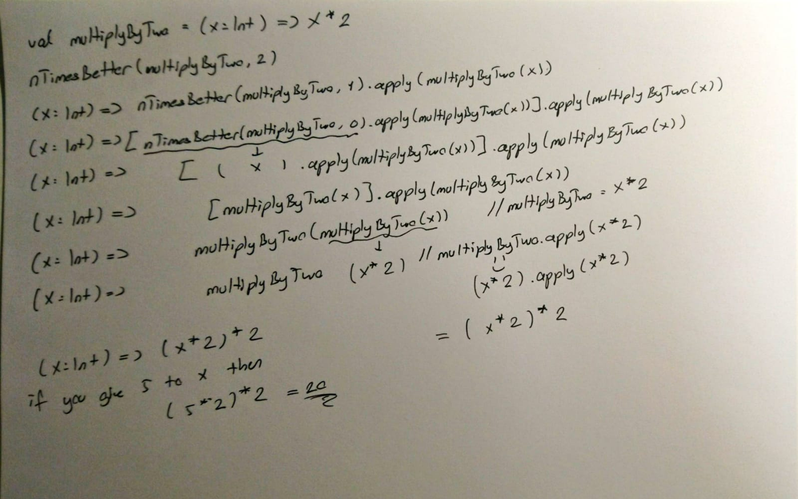

# Scala Functions

Temel yapitaslari java ile benzer aslinda.
Ilk once bir trait tanimladik, 

```scala
trait MyFunction[A,B] {
    def apply(element: A): B
}
```

daha sonra anonymous olarak bu trait i tanimladim
```scala
val doubler = new MyFunction[Int, Int] {
    override def apply(element: Int): Int = element * 2
}
```

daha sonra anonymous olarak yarattigim fonksiyonu (aslinda hala gercek anlami ile fonksiyon degil, trait in instance'i burda, ayni java'da ki Functional Interface i anonymous olarak yaratip bir variable a atamamiz gibi) kullanabilirim.

```scala
println(doubler(2))
```

Scala biz her seferinde bir trait yaratmayalim diye, hazir Function1, Function2 seklinde traitler yaratmis. Function1 bir adet arguman alip bir tane geri donuyor, function2 2 arguman alip 1 tane donuyor vs

ornek:
```scala
val stringToIntConverter = new Function1[String, Int] {
    override def apply(element: String): Int = element.toInt
}

println(stringToIntConverter("2") + 3)
```
yukaridaki kod bize 5 vericektir.

baska bir ornek
```scala
var adder = new Function2[Int, Int, Int] {
    override def apply(elem1: Int, elem2: Int): Int = elem1 + elem2
}

println(adder(3,5))
```
bize 8 donecektir.

Normalde scala da fonksiyonumuz veya methodumuz recursive degil ise donus tipini belirtmemize gerek yok, scala kendi anliyor. Fakat belirtmek istersek bunu 2 sekilde yapabiliriz. Mesela multiplyer diye yeni bir fonksyion yapalim
```scala
val multiplyer: [Int, Int, Int] = new Function2[Int, Int, Int] {
    override def apply(elem1: Int, elem2: Int): Int = elem1 * elem2
}
```

ikinci bir yol ise
```scala
val multiplyer: ((Int, Int) => Int) = new Function2[Int, Int, Int] {
    override def apply(elem1: Int, elem2: Int): Int = elem1 * elem2
}
```
yapmaktir, boylece multiplyer in 2 Int arguman alan ve bir Int arguman donen bir fonksiyon oldugunu belirtmis oluyoruz.

scala da fonksiyon donen fonksiyonlar: baska turlu yapmanin yolu var mi bilmiyorum ama, sanirim anca clousure kullanarak yapilabiliniyor.
ornek:
```scala
val test = new Function1[Int, Function1[Int, Int]] {
    override def apply(x: Int): Function1[Int, Int] = new Function1[Int, Int] {
        override def apply(y: Int): Int = x + y
    }
}
```

daha sonra bu fonksiyonu iki sekilde kullanabiliriz, ilki:
```scala
val tempFunc = test(2)
println(tempFunc(3))  // yields 5
```
burda test e atadigimiz fonksiyonu cagirarak tempFunc a yeni bir fonksiyon atanmasini sagladik. daha sonra bunu kullanarak return degerini alabildik. Burda closure var, yani biz tempFunc(3) dedigimizde fonksiyon aslinda outer value olan x'i yani 2 yi hala memory de tutuyor, boylece tempFunc(3) parametresi ile cagirdigimizda x+y toplamini yapabiliyor.

diger bir yontem ise:
```scala
println(test(2)(3))
```

### scala da anonymous fonksiyonlar
simdiye kadar fonksiyon yaratma yontemlerimiz aslinda object oriented tarzdaydi
ornegin:
```scala
val adder = new Function2[Int, Int, Int] {
    override def apply(x: Int, y: Int): Int = x + y
}
```

bu da bir anonymous fonksiyon fakat yaratilis sekli object oriented way. Bunun yerine assagidaki gibi de fonksyion yaratabilmemiz mumkun

```scala
val adder = (x, y) => x + y
```

bu yukaridaki ornek ile tamamen ayni ama burda lambda notasyonu kullandik.
Assagidaki 3 farkli gosterim de valid ve gecerlidir:
```scala
val newAdder = (q: Int, w: Int) => q+w
val newAdder2: ((Int, Int) => Int) = (q, w) => q + w
val newAdder3: Function2[Int, Int, Int] = (q ,w) => q + w
```

normalde return val newAdder in type'ini belirtmesek bile scala bunu anlayabiliyor o yuzden illa belirtmemize gerek yok (fonksiyon recursive olmadigi surece).

eger hicbir parametre almiyacaksa lambda fonksiyonu assagidaki sekilde tanimlanir:
```scala
val justDoSomething = () => 3 // just returns 3
val justDoSomething2: () => Int = () => 3 // same as above
```

baska bir lambda gosterimi:
```scala
val stringToInt = { (str: String) =>
    str.toInt
}
```

lambda icin syntactic sugar:
```scala
val niceIncrementer: Int => Int = x => x + 1
val niceIncrementer2: Int => Int = _ + 1
```

dikkat edilmesi gereken nokta her kullandigimi _ sembolu diger bir argumani gosterir, ve eger _ kullanmak istiyorsak val in type'ini belirtmemiz gerekir, aksi halde complier ne tur deger gelecegini bilemez.

```scala
val niceAdder: (Int, Int) => Int = _ + _ // first _ first  argument second _ is second argument
```

lambda notasyonu ile fonksiyon donduren fonksiyon yapilmasi: yukarida bunu object oriented way ve yine new keyword u ile anonymous function kullanarak yapmistik. Simdi lambda notasyonu ile yapicaz.

```scala
val testX = (x: Int) => (y: Int) => x + y
val testY = testX(2)
val result = testY(3) // returns 5
```

### Higher Order Functions and Curries
Icine arguman olarka fonksiyon alan veya fonksiyon donen veya hem fonksiyon alip hem fonksiyonon donen fonksiyonlara higher order functions deniyor

karisik bir ornegi:
```scala
val superFunction = (Int, (String, (Int => Boolean)) => Int) => (Int => Int)
```
bunu anlamak icin parcalara bolmemiz lazim, en soldaki taraf yani (Int => Int) bize tum bu argumanlari alan fonksiyonun bir fonksiyon dondugunu belirtiyor.
Simdi argumanlara bakalim.
(Int, (xxx) => Int) diye bakabiliriz, bu bize arguman olarak bir Int ve bir de Int donduren bir fonksiyon aldigini soyluyor
xxx = (String, (Int => Boolean)) burasi da bize aslinda bunun arguman olarka bir String bir de Int alip Boolean donduren bir fonksiyon aldigini soyluyor.

hof ornegi: oyle bir fonksiyon yazmak istiyoruz ki, icine fonksiyon alsin, o fonksiyonun kac kez tekrar edileceginin value'sunu alsin ve fonksiyona verilecek degeri alsin
```scala
def nTimes(myFunc: Int => Int, n: Int, x: Int) = {
    if(n <= 0) x
    else(nTimes(myFunc, n-1, myFunc(x)))
}

val plusOne = (x: Int) => x + 1
println(nTimes(plusOne, 10, 1)) // prints 11
```
yukaridaki fonksiyon istedigimizi yapiyor. Simdi bu fonksiyonu inceleyelim.
eger hic tekrar etme dersek yani n e 0 verirsek sadece x degerini donuyor, yani x i hic fonksiyon icine sokmadan bize veriyor. Eger n degeri 0 dan buyukse o zaman n degeri kadar fonksiyonu cagiriyor ama soyle bir durum var

nTimes(myFunc, 2, 1) demek : myFunc( myFunc(1) ) demek oluyor, yani bir kez myFunc u cagirdik ve ondan donen degeri tekrar myFunc a verdik

nTimes(myFunc, 3 ,1) ise : myFunc( myFunc( myFunc(1) ) ) demek oluyor.

o zaman su sekilde genelleyebiliriz.
nTimes(myFunc, n, x) : nTimes(myFunc, n-1, myFunc(x)) = nTimes(myFunc, n-2, myFunc( myFunc(x) ) 
yani o zaman yukaridaki scala kodu gibi bunu recursive sekilde tanimlayabiliriz.


yukaridaki ornekte nTimes fonksiyonu gun sonunda Int donduruyordu, simdiki ornekte ise Int yerine baska bir fonksiyon dondurecek.

```scala
def nTimesBetter(myFunc: Int => Int, n: Int): Int => Int = { //nTimes better takes 2 arguments first is a function(a function that takes and returns int) second one is Int and returns another function (that function takes and returns Int)
    if(n<=0) (x:Int) => x
    else (x:Int) => nTimesBetter(myFunc, n-1)(myFunc(x))
}
```

yukaridaki ornekte hem if hem else kismi yeni birer fonksiyon donduruyorlar, fakat else kismi nTimesBetter i bir kez daha cagiriyor ve arguman olarka myFunc(x) in sonucu veriliyor.
```scala
val plus10 = nTimesBetter(plusOne, 10)
println(plus10(1)) // prints 11
```

`nTimesBetter` i biraz daha acalim simdi. `nTimesBetter(addOne, 2)` seklinde kullandigimizi varsayalim. 
ilk geri donucek fonksiyon su sekildedir
```scala
(x: Int) => nTimesBetter(addOne, 1)(addOne(x))
// same as:
(x: Int) => nTimesBetter(addOne, 1).apply(addOne(x))
```
`nTimesBetter(addOne, 1)` ise asagidaki sekilde donucek
```scala
(x: Int) => nTimesBetter(addOne, 0)(addOne(x))
// same as:
(x: Int) => nTimesBetter(addOne, 0).apply(addOne(x))
```
`nTimesBetter(addOne, 0)` ise asagidaki sekilde donuce
```scala
(x: Int) => x(addOne(x))
// same as:
(x: Int) => x.apply(addOne(x))
```
hepsini toparlarsak asagidaki gibi bir sonuc elde ediyoruz.
```scala
(x: Int) => ((x.apply(addOne(x))).apply(addOne(x))).apply(addOne(x))
```
apply methodu aslinda x gordugun yere argumani koy demek
asagidaki basit ornege bakalim mesela
```scala
val func = (x: Int) => x + 1
func(2)
// same as:
func.apply(2)
```
`func.apply(2)` ise func yani `x => x + 1` fonksiyonunda x argumani 2 alicak demek o da `x => 2 + 1` yapar.
o zaman `x.apply(addOne(x))` te `x` gordugun yere `addOne(x)` koy demektir.
bu da direk `addOne(x)` yapar. O zaman bizim 2 ustteki fonksiyonu yeniden duzenlersek su sekilde olucaktir.
```scala
(x: Int) => (addOne(x).apply(addOne(x))).apply(addOne(x))
// same as:
(x: Int) => addOne(addOne(x)).apply(addOne(x))
// same as:
(x: Int) => addOne(addOne(addOne(x)))
```
`nTimesBetter` yukaridaki fonksiyonu bize dondurecektir. daha sonra bu fonksiyonu x parametresi ile cagirirsak yani `nTimesBetter(addOne, 2)` bize yukaridaki fonksiyonu dondu bunu `val funcX` e atadik diyelim 

`val funcX = nTimesBetter(addOne, 2)`  
daha sonra `funcX(1)` dedigimizde yukaridaki fonksiyonda x yerine 1 koymus olucaz. `funcX.apply(1)` yani o da bu demek aslinda

```scala
addOne(addOne(addOne(x))).apply(1)
// same as:
addOne(addOne(addOne(1)))
```
hatirlarsak `addOne(1)` bize `2` donucek, `addOne(2)` ise `3` donucek. `addOne(3)` ise `4` donmus olucak.

another Example:


## Scala curries

Bir tane adder tanimlayalim
```scala
def superAdder(x: Int): (Int => Int) = (y: Int) => x + y
```
bu goruldugu gibi arguman olarka Int alip Int => Int bir fonksiyon dondurmekte.bunu assagidaki gibi kullanabiliriz.
```scala
val temp1 = superAdder(2) // meaning : 2 + y
val temp2 = temp1(5) // meaning : 2 + 5
println(temp2) // prints 7
```
asagidaki yazim ise tamamen ayni yukaridaki islem ile
```scala
def superAdderCurried(x: Int)(y: Int): Int = x + y
```
bunu da assagidaki gibi kullanabiliriz
```scala
val temp4: (Int => Int) = superAdderCurried(2)
val temp5 = temp4(5)
println(temp5)
```
burda onemli olan yukaridakinden farkli olarak
`val temp4: (Int => Int) = superAdderCurried(2)` seklinde temp4 un tipini belirttik, aksi halde compiler dan hata aliriz, cunku temp4 superAdderCurried(2) nin ne tip dondurecegibi bilemez.

Baska bir ornek:
```scala
def curriedFormatter(c: String)(x: Double): String = c.format(x)

val standartFormat: Double => String = curriedFormatter("%4.2f") // meaning : "%4.2f".format(x)
val preciseFormat: Double => String = curriedFormatter("%10.8f") // meaning : "%10.8f".format(x)

println(standartFormat(Math.PI)) // meaning : "%4.2f".format(Math.PI) prints: 3.14
println(preciseFormat(Math.PI))  // meaning : "%10.8f".format(Math.PI) prints: 3.14159265
```

## exercises for curries
a function that takes a function and returns a curried function
```scala
def toCurry(f: (Int, Int) => Int): (Int => Int => Int) = x => y => f(x, y)

val myAdder: (Int, Int) => Int = (x, y) => x + y
val temp10 = toCurry(myAdder)
println(temp10(3)(5)) // prints 8
```

toCurry fonksiyonunu inceleyelim. `x => func1` diyelim. yani x bir fonksiyon dondurecek. Dondurdugu fonksiyon da `y => f(x,y)` seklinde bir fonksyion, f ise herhangi bir baska fonksiyon, yukaridaki ornekte mesela f fonksiyonunu x + y olarka tanimaldik. o zaman aslinda bizim dondurdugumuz fonksiyon su sekilde oluyor  
`x => y => x + y`  
yani curried bir fonksiyon dondurmus oluyoruz.

simdi assagidaki ornege bakalim
```scala
def superAdder2: (Int => Int => Int) = toCurry(_ + _)
def add4 = superAdder2(4)
println(add4(17)) // prints 21
```
yukaridaki ile cok benzer bir islem yaptik (_ + _) demek toCurry fonksiyonuna f(x,y) => x + y seklinde bir fonksiyon veriyorum demek. Ve bize return olarak curried fonksiyon donuyor.

simdi assagidaki ornegi inceleyelim
```scala
def fromCurry(f: Int => Int => Int): (Int, Int) => Int = (x, y) => f(x)(y)

val myCurryAdder: (Int => Int => Int) = x => y => x + y
val temp11 = fromCurry(myCurryAdder)
println(temp11(3, 5))
```

bu sefer fromCurry fonksiyonuna bir curried fonksiyon verdik. donusu icin de bize iki int argumani alan ve int donen bir fonksiyon vermesini sagladik. 
`(x, y) => f(x)(y)` demek aslinda `[f.apply(x)].apply(y)` demektir. Yani fromCurry bize `[f.apply(x)].apply(y)` donmus oldu. f ise `y => x + y` diye bir fonksiyon.
o zaman aslinda  
`[(y => x + y).apply(x)].apply(y)` seklinde bir fonksiyonumuz oluyor. x yerine 3 koyarsak  
`[(y => x + y).apply(3)].apply(y)` = `[(y => 3 + y)].apply(y)` oluyor. daha sonra y yerine 5 koyarsak toplam 8 i elde ediyoruz.

baska bir ornek
```scala
val simpleAdder = fromCurry(superAdder2)
println(simpleAdder(4, 17)) // prints 21
```

yukarida superAdder2 yi bir curried function a donusturmustuk, burda ise onu tekrardan 2 parametre alip int donen bir fonksiyona donusturduk.

compose ve andThen ornekleri
```scala
def compose[A, B, T](f: A => B, g: T => A): T => B = x => f(g(x))
def andThen[A, B, C](f: A => B, g: B => C): A => C = x => g(f(x))

val add2 = (x: Int) => x + 2
val times3 = (x: Int) => x * 3

val composeResult = compose(times3, add2)
println(composeResult(2)) // prints 12

val andThenResult = andThen(times3, add2)
println(andThenResult(2)) // print 8
```


