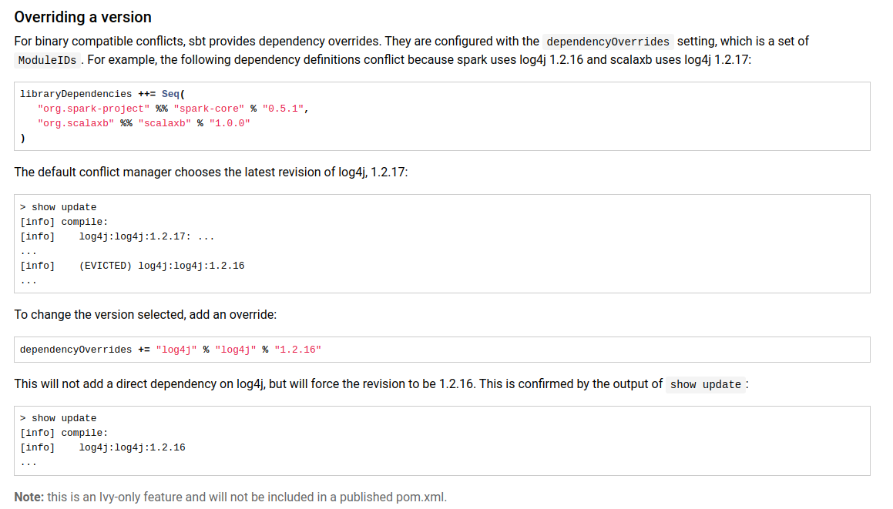

# Spark - Scala Grep Task

* jackson dependency ile ilgili problem yasarsan sbt de gidip dependencyOverrides demen lazim tum build.sbt assada
    ```
    name := "ScalaGrep"

    version := "0.1"

    scalaVersion := "2.11.12"

    // https://mvnrepository.com/artifact/org.apache.spark/spark-core
    libraryDependencies += "org.apache.spark" %% "spark-core" % "2.3.4" % "provided"

    // https://mvnrepository.com/artifact/org.apache.spark/spark-sql
    libraryDependencies += "org.apache.spark" %% "spark-sql" % "2.3.4"

    // https://mvnrepository.com/artifact/org.apache.hadoop/hadoop-hdfs
    libraryDependencies += "org.apache.hadoop" % "hadoop-hdfs" % "3.1.2"

    // https://mvnrepository.com/artifact/org.apache.hadoop/hadoop-common
    libraryDependencies += "org.apache.hadoop" % "hadoop-common" % "3.1.2"

    // https://mvnrepository.com/artifact/org.apache.hadoop/hadoop-client
    libraryDependencies += "org.apache.hadoop" % "hadoop-client" % "3.1.2"
    
    dependencyOverrides += "com.fasterxml.jackson.core" % "jackson-core" % "2.8.7"
    dependencyOverrides += "com.fasterxml.jackson.core" % "jackson-databind" % "2.8.7"
    dependencyOverrides += "com.fasterxml.jackson.module" % "jackson-module-scala_2.11" % "2.8.7"
    ```

* cakisma oldugu zaman ivy sanirim dependency conflict manager ile bir versiyonu seciyor ama istedigimiz versiyonu sectirmek icin dependencyOverrides dememeiz lazim. link burda 



* sbt assembly ile jumbo jar yaptik (spark mapreduce deki ile ayni assembly)

* daha sonra server a attik ve su komutla calistirdik `./spark-submit --class com.senko.SparkGrep --master spark://mond45:7077 ~/ScalaGrep-assembly-0.1.jar /user/hadoop/input/generated.txt /user/hadoop/output4 cluster
`


