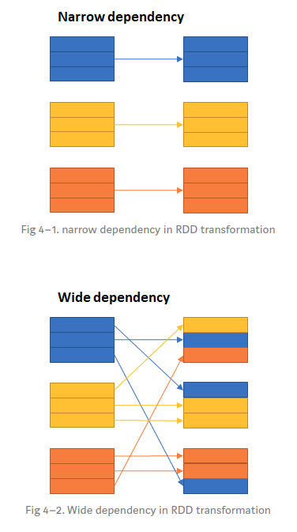
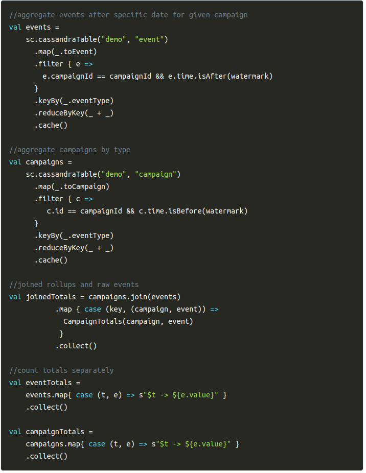
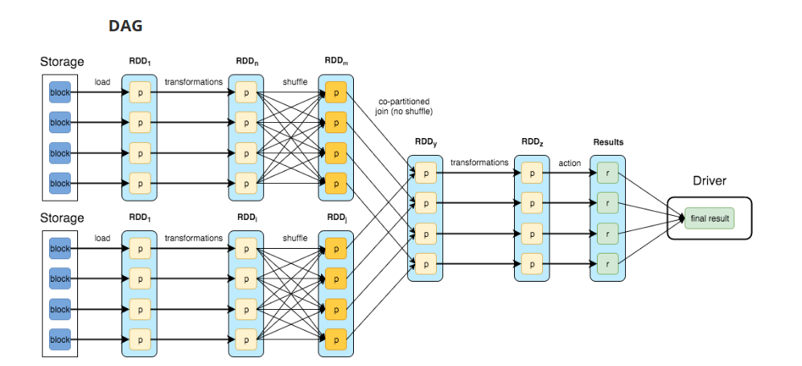

* spark normalde ona verdigin datayi partitionlara ayiriyor, eger hdfs ten veriyorsan zaten parition seklinde geliyor, eger bir file dan veriyorsan da bu file'in bir shared file system de olmasi gerek. (Lokal haric muhtemelen)

* mesela adam soyle bisi yapmis su linkte: https://medium.com/@mrpowers/managing-spark-partitions-with-coalesce-and-repartition-4050c57ad5c4

* 
```scala
val x = (1 to 10).toList
val numberDf = x.toDF("number")

// daha sonra partition sayisini ogrenmek istediginde
numberDf.rdd.partitions.size // => 4 aadamin makina da 4 vermis
numbersDf.write.csv("/users/spark_output/numbers")

// yaz dedigin zaman seperate CSV dosyalari olarak yazacak, eger 4 partition a aynirmissa 4 csv olucak

```

* coalesce methodu partitionlari diledigimiz parttiion saysisina dusurmek icin kullaniliyor `val numberDf2 = numbersDf.coalesce(2)` dediginde, 4 olan partition sayisi 2 ye indirilecek spark tarafindan.

* tabii coalesce yaparken bir partitoin daki datalari diger partition a tasimak zorunda, yani network uzerinde dosya tasiyor.

* repartition methodu ise hem partition azaltmaya hem de arttirmaya yariyor ve full shuffle yapiyor, yani datayi partitionlar arasinda equally bir sekilde yaymaya calisiyor, coalesce ise partition azaltirken en az network trafigi yaraticak sekilde yapmaya calisiyor bunu. aralrainda boyle bir fark var.

* default'ta onerilen partition sayisi clusterdaki core * 3 veya *4 olmasi gerekiyormus. 

* partition icin atomic chunk of data (logical division of data) stored on a node in the cluster denmis. Haliyle bir serverda veya worker da birden fazla partition olabilir. 

* spark'taki task driver'dan executer'lara gonderdigimiz commandlar, flatmap, map vs gibi. Sen sparkContext yarattiginda, her worker da bir executor baslatiyor ve komutlar driver'dan executor'a gidiyor, Driver quit oldugunda executor'lar da shutdown oluyor. 

* executor ile worker arasindaki iliski, executorlar workerlarda calisiyor ve bir workerda birden cok executor olabiliroyr. Mesela eger worker a 24gb ram vermissek ve executor'un memory'sine de 12 demissek 1 worker altinda 2 executor olabiliyor. 

* Sen spark submit yaptiginda driver hemen worker ile konusuyor ve workerlar executor'lari baslatiyor, bundan sonra executorlar driver'a register oluyor ve driver bunlara task submitlemeye basliyor. Burda worker'in gorevi ise kendisindeki resource'larin durumunu cluster manager'a belirtmek.

* executor-cores : 1 executor'a ne kadar core verilcek  
--total-executor-cores : bir application da toplam executorlar ne kadar core kullanabilir.

* default'ta worker icinde bir tane executor aciliyor, mesela 5 worker node'umuz var ve her node'ta da 8 core var, o zaman toplamda 5 tane executor acilir ve her biri 8 core kullanir.

* workers'i slave nodes'in bir diger adi gibi dusunebilirsin. Veya slave olarak kullanilan node'larda bir Java/Scala applicaiton. JVM icinde yasiyor yani. 

* su link fena anlatmamis : http://www.informit.com/articles/article.aspx?p=2928186

* RDD'lerde transformation'lar. filter, map, union, distinct gibi islemler, action'lar ise take, show, collect, foreach gibi islemler ve transformationlar lazy ancak bir action ile belirtildiklerine calisiyorlar. 

* 2 tip transformation dependecy var, narrow ve wide. narrow olan o executor icinde gerceklesiyor ve yeni RDD sadece parent ile iliskili, wide'ta ise shuffle yapiliyor. 



*Bir job un icinde birden cok stage'te olabilir. 

* burda yine fena anlatilmami : https://blog.usejournal.com/spark-study-notes-core-concepts-visualized-5256c44e4090

* su linkte : http://datastrophic.io/core-concepts-architecture-and-internals-of-apache-spark/  
bu kodu: 


bu da DAG representatoionU


* RDD operations with "narrow" dependencies, like map() and filter(), are pipelined together into one set of tasks in each stage operations with shuffle dependencies require multiple stages (one to write a set of map output files, and another to read those files after a barrier).

* Shuffle spill is controlled by the spark.shuffle.spill and spark.shuffle.memoryFraction configuration parameters. If spill is enabled (it is by default) then shuffle files will spill to disk if they start using more than given by memoryFraction (20% by default).

* yani kendisine verilenden %20 daha fazla memory kullanmaya baslarsa shuffle, gidip bunu disk e yaziyor.

* narrow transformationlar : map, flatMap, MapPartition, Filter, Sample, Union  
wide transformationlar : Intersection, distinct, reduceByKey, GroupByKey, join, cartesian, Repartition, coalesce

* spark interanls baya guze : https://github.com/JerryLead/SparkInternals
* distributed systemler ile iligili guzel bi site : https://0x0fff.com/category/spark/